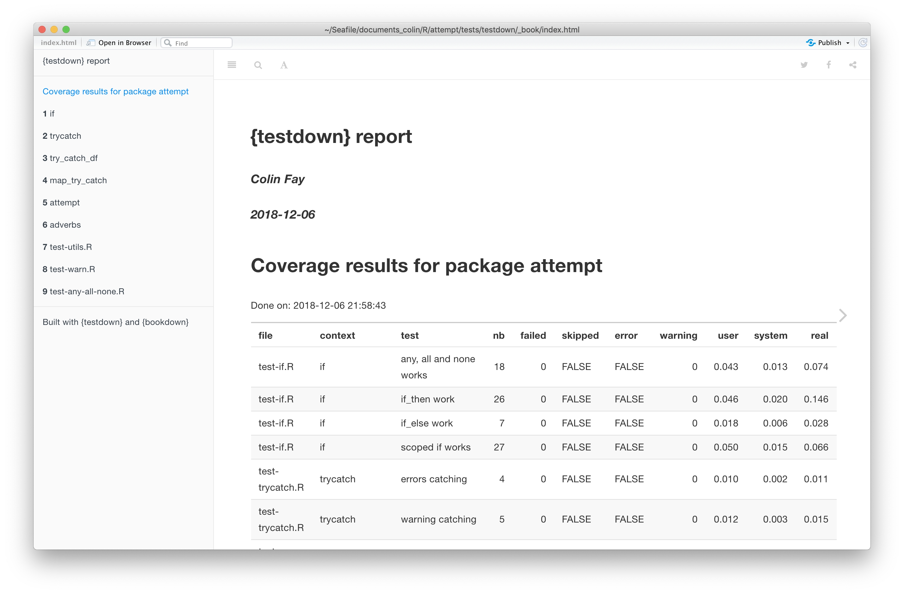
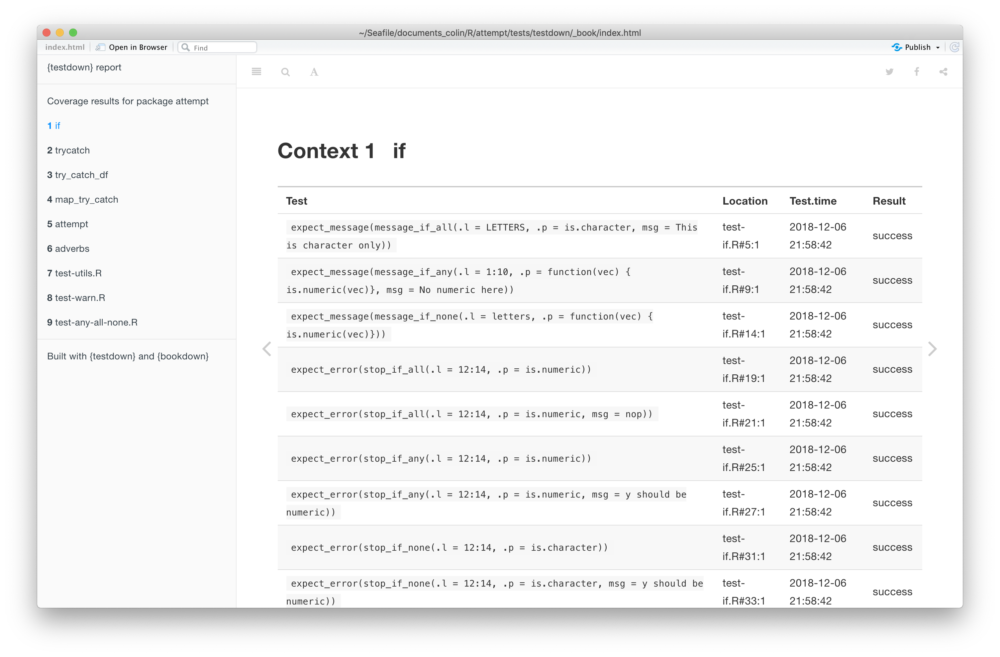

<!-- README.md is generated from README.Rmd. Please edit that file -->

[](https://www.tidyverse.org/lifecycle/#experimental)

# testdown

The goal of testdown is to create a bookdown with results from
{testthat}.

## Installation

You can install the released version of testdown from GitHub with:

``` r
remotes::install_github("ThinkR-open/testdown")
```

## About

This package has only one exported function, `test_down()`. It takes:

  - The path to a package: default is “.”, so it can be run from the
    command line while developping a package
  - The path to export the bookdown to. Default is `test/testdown`.
  - `open`: should the book be opened after compilation? Default is
    `TRUE`.

## Screenshot

The first page has a summary of the tests.



Then, each chapter is a context, with a detail of each result.



## Inspiration

This package is heavily inspired by the output provided the [SASUnit
Unit testing for SAS(tm)-programs](https://sourceforge.net/p/sasunit/).

## CoC

Please note that this project is released with a [Contributor Code of
Conduct](CODE_OF_CONDUCT.md). By participating in this project you agree
to abide by its terms.
